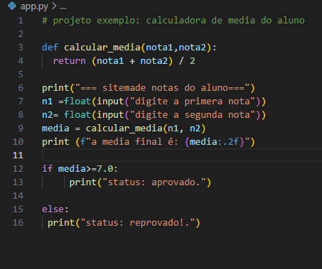
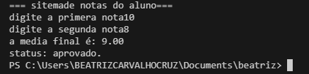

# **Calculadora de media de um aluno - feito por Beatriz**
## **Python 3.13**
### Nessse codigo a proposta é otimizar o tempo na hora do fechamento da media de forma clara e rapida e objetiva com espasos para colocar os numeros corespondendes as notas e calculados pensndo na media 7 aparendo Aprovado e reprovado dependendo da meia final do aluno de um aluno 

# Exemplo de uso ou demostração: IDR da sua preferencia ou compilador online 

### contato tel 11916206586 linkedln.com/in/carvalhocbeatriz